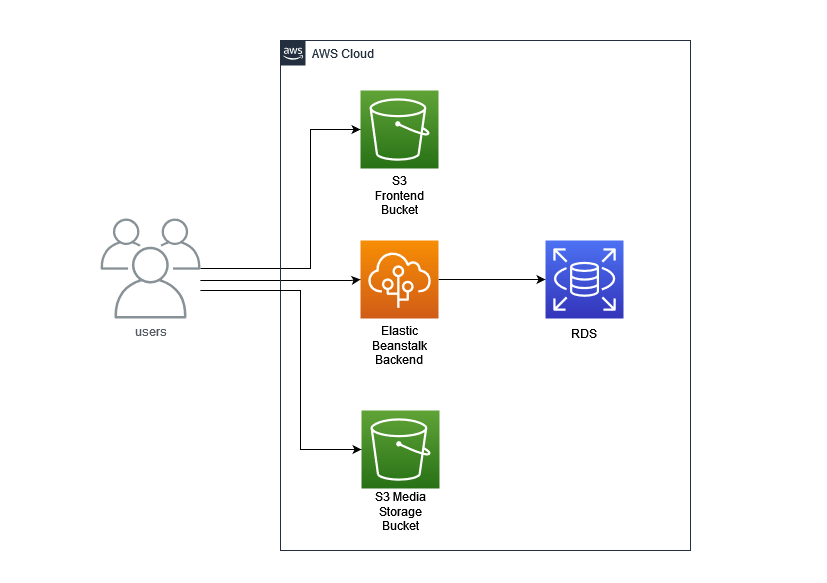
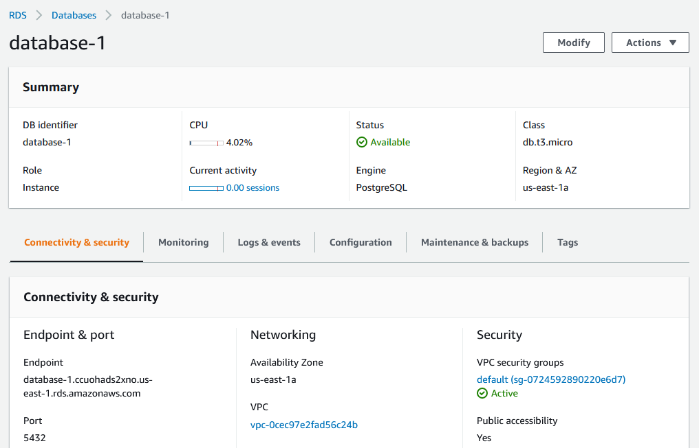
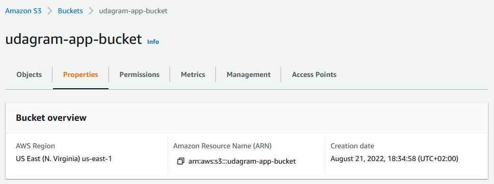
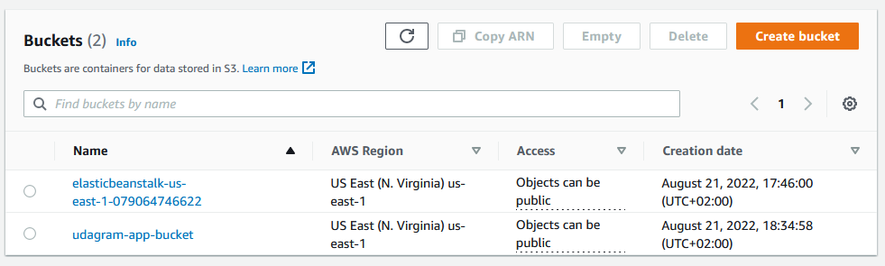
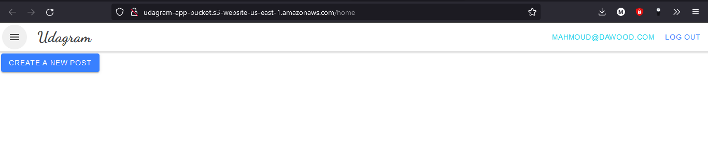
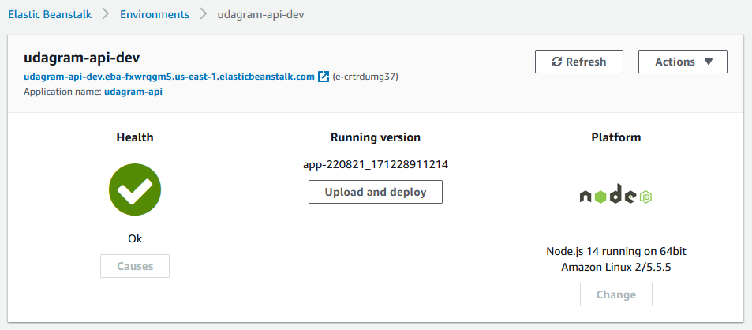
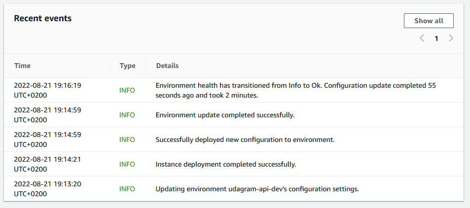
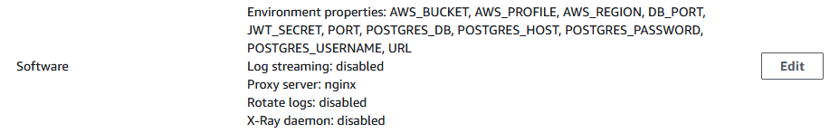
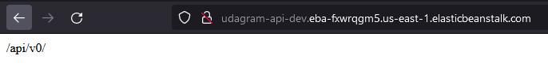
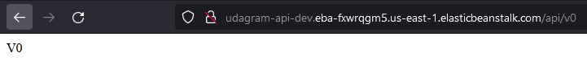

# Application Infrastructure

### **Cloud infrastructure for Udagram deployment on *AWS***

## Infrastructure Diagram

## Used services
- [RDS](#rds) for backend database 
- [Elastic Beanstalk](#eb) for backend server
- [S3 bucket](#s3) for frontend hosting
- [S3 bucket](#s3) for media storage

---

## RDS
Service for managing relational databases.

Created instance.

---

## S3
Service for cloud scalable storage.

Created instance.
 

Working Frontend deployed [here](http://udagram-app-bucket.s3-website-us-east-1.amazonaws.com)

---

## EB
Service for running and mangain web applications.

Created instance.
 

Elastic beanstalk created environment variables.
 

Working Backend deployed [here](http://udagram-api-dev.eba-2tikbxrx.us-east-1.elasticbeanstalk.com/)
 

## Hosted Udagram Application deployed [here](http://udagram-app-bucket.s3-website-us-east-1.amazonaws.com) 