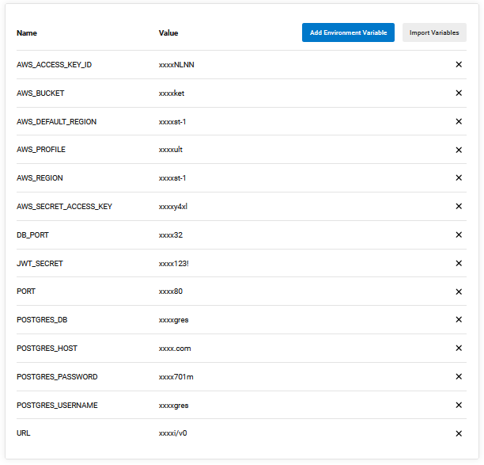

# Pipeline

### **Pipeline workflow for CI/CD after commiting a change.**

## Pipeline Diagram

## Steps after pushing changes to main branch
1. Install frontend dependencies
2. Install backend dependencies
3. Build frontend
4. Build backend
5. Test frontend
6. Test backend
7. Deploy frontend
8. Deploy backend

---

## Pipeline Status: 
 

## Last CircleCi Build

 

 
CircleCi environment variables.
